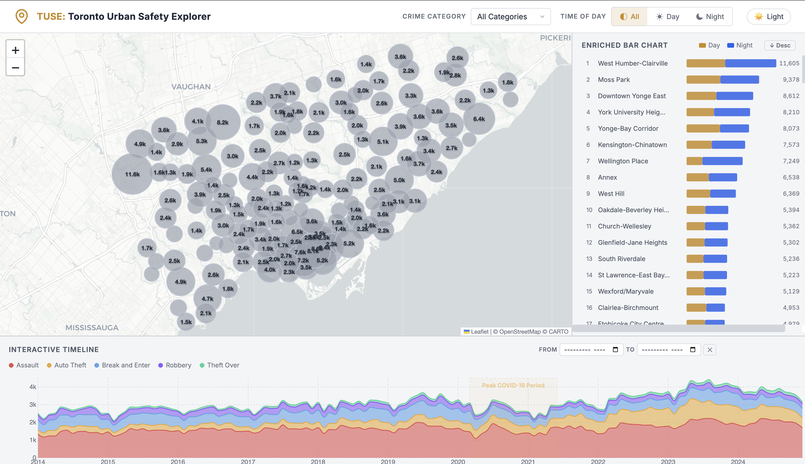

# TUSE: Toronto Urban Safety Explorer

An interactive multi-view dashboard for exploring Toronto's Major Crime Indicators dataset (2014-2024). Built with **D3.js** and **Leaflet**, the dashboard provides linked spatial, temporal, and neighbourhood-level visualizations to help users discover crime patterns across the city.



---

## Table of Contents

- [Features](#features)
- [Tech Stack](#tech-stack)
- [Project Structure](#project-structure)
- [Architecture Overview](#architecture-overview)
- [Data Pipeline](#data-pipeline)
- [Implementation Details](#implementation-details)
- [Getting Started](#getting-started)
- [Usage Guide](#usage-guide)
- [Data Source](#data-source)
- [License](#license)

---

## Features

### Clustered Spatial Map

- Leaflet base map with D3 SVG overlay using `L.svg({ interactive: true })`
- **158 neighbourhood-level clusters** with proportional circle sizing (scaled via `d3.scaleSqrt`)
- Hover reveals neighbourhood name, crime count, full category breakdown, and Day/Night split - all dynamically filtered to match the active year range
- **Click-to-select**: clicking a cluster persistently highlights it (white border + glow), dims all other clusters, and auto-scrolls the bar chart to the corresponding row. Selection is maintained until the user clicks another cluster or clicks the map background to clear
- Distinct neutral gray color for "All Categories" view to differentiate from individual crime category colors
- Clusters update dynamically when filters (category, time of day, year range) are applied
- Supports **Dark** and **Light** CARTO tile layers, swappable via the theme toggle

### Enriched Horizontal Bar Chart

- Lists **all 158 neighbourhoods** in Toronto ranked by total crime volume (scrollable)
- Each bar is split into **Day** (gold) and **Night** (blue) segments, with incident counts right-aligned
- **Sort toggle** in the header to switch between descending and ascending order
- **Click-to-select**: clicking a bar row persistently highlights it, highlights the corresponding map cluster, and **flies the map to center on that cluster** at zoom level 14
- Hover highlights the corresponding cluster on the map (and vice versa) with auto-scroll to visible row

### Interactive Timeline

- Stacked area chart showing monthly trends for all 5 crime categories
- **Linked brushing** - drag to select a time range and all other views filter accordingly
- **Date input fields** (From/To month pickers) - manually enter a date range as an alternative to brushing; inputs sync bidirectionally with the brush
- **Clear button** to reset the date range and brush selection
- Dimming overlays highlight the selected period, with a date-range badge
- COVID-19 annotation marks the pandemic peak (Mar 2020 - Jun 2021)

### Cross-View Linking

All three views are fully linked through a custom event bus:

| Interaction | Effect |
|---|---|
| **Category dropdown** | Updates map circle colors/sizes, bar chart rankings, timeline area highlighting |
| **Day / Night toggle** | Filters map clusters and bar chart segments |
| **Timeline brush / date inputs** | Filters map and bar chart to the selected year range |
| **Map hover** | Shows tooltip + temporarily highlights corresponding bar chart row |
| **Bar chart hover** | Temporarily highlights corresponding map cluster |
| **Map click (select)** | Persistently highlights cluster + scrolls bar chart to corresponding row |
| **Bar chart click (select)** | Persistently highlights bar row + flies map to center on corresponding cluster |
| **Map background click** | Clears persistent selection across all views |

---

## Tech Stack

| Layer | Technology | Purpose |
|---|---|---|
| Visualization | [D3.js v7](https://d3js.org/) | SVG rendering, data joins, scales, axes, brush, and transitions |
| Map | [Leaflet v1.9.4](https://leafletjs.com/) + [CARTO](https://carto.com/) tiles | Interactive slippy map with zoom/pan, `L.svg()` overlay for D3 circles |
| Data Pipeline | Python 3 + Pandas | CSV to JSON data processing and aggregation |
| Styling | Vanilla CSS with CSS custom properties | Dark/light theming, glassmorphism tooltips, responsive grid layout |
| Typography | [Inter](https://fonts.google.com/specimen/Inter) via Google Fonts | Clean, modern sans-serif font with tabular numerals |

---

## Project Structure

```
src/
├── index.html                    # Dashboard HTML shell - header controls, 3-panel grid, scripts
├── styles.css                    # Full CSS design system (both dark + light themes)
├── pipeline.py                   # Python data processing pipeline (CSV to 4 JSON files)
├── .gitignore                    # Excludes raw CSV, processed JSON, .venv, etc.
│
├── js/
│   ├── main.js                   # Entry point - data loading, event bus, cross-view wiring
│   ├── spatialMap.js             # Leaflet + D3 clustered map (L.svg overlay, click-to-select, fly-to)
│   ├── timeline.js               # Stacked area chart with D3 brush + date input API
│   └── barChart.js               # Horizontal bar chart (Day/Night split, sort toggle, all 158 hoods)
│
├── data/
│   ├── major-crime-indicators.csv      # Raw dataset (~120 MB, not in git)
│   └── processed/                      # Generated JSON files (not in git)
│       ├── spatial_clusters.json       # 158 neighbourhood centroids (~70 KB)
│       ├── spatial_data.json           # Full per-incident records (~100 MB)
│       ├── temporal_data.json          # Monthly time-series (~89 KB)
│       └── neighbourhood_data.json     # Neighbourhood × category × year × day/night (~2.7 MB)
│
└── docs/
    └── dashboard_preview.png           # Screenshot for README
```

---

## Architecture Overview

The dashboard follows a **module-pattern architecture** where each view is an IIFE (Immediately Invoked Function Expression) that exposes a public API. Communication between views is handled through the **DOM custom event bus** wired in `main.js`.

```
+----------------------------------------------------------+
|                       main.js                            |
|  (Entry point - loads data, wires events, initializes)   |
|                                                          |
|  +----------------+  CustomEvents  +------------------+  |
|  | SpatialMap     | <------------> | BarChart         |  |
|  |  .init()       |  map-hover     |  .init()          |  |
|  |  .setCategory()|  bar-hover     |  .setCategory()   |  |
|  |  .setTimeOfDay |  cluster-select|  .setTimeOfDay()  |  |
|  |  .setYearRange |  bar-select    |  .setYearRange()  |  |
|  |  .setTheme()   |                |  .toggleSort()    |  |
|  |  .panTo()      |                |  .select/         |  |
|  |  .select/      |                |   highlight()     |  |
|  |   highlight()  |                |                    |  |
|  +----------------+                +------------------+  |
|           ^                                ^             |
|           |         timeline-brush          |             |
|           +------------+ +-----------------+             |
|                  +-----v-v-------+                       |
|                  | Timeline      |                        |
|                  |  .init()      |                        |
|                  |  .setCategory |                        |
|                  |  .setBrush()  |                        |
|                  +---------------+                        |
+----------------------------------------------------------+
```

### Event Flow

1. **User interacts** with a control (dropdown, toggle, brush, click) in one view
2. The view dispatches a **CustomEvent** on `document`
3. `main.js` listens for the event and calls the appropriate method on the other views
4. Each view re-renders internally using D3 data joins and transitions

### Key Custom Events

| Event Name | Payload | Source -> Target |
|---|---|---|
| `map-hover` | `{ hood_id }` | SpatialMap -> BarChart |
| `bar-hover` | `{ hood_id }` | BarChart -> SpatialMap |
| `cluster-select` | `{ hood_id }` | SpatialMap -> BarChart (persistent + scroll) |
| `bar-select` | `{ hood_id }` | BarChart -> SpatialMap (persistent + fly-to) |
| `timeline-brush` | `{ yearRange, dateRange }` | Timeline -> SpatialMap + BarChart |

---

## Data Pipeline

The pipeline (`pipeline.py`) reads the raw ~120 MB CSV and produces 4 optimized JSON files. This pre-aggregation step is critical for performance - the dashboard can load and render 158 clusters instantly instead of processing 400K+ individual records in the browser.

### Pipeline Steps

```
major-crime-indicators.csv (420K rows)
        │
        ▼
   load_and_clean()
   - Drop nulls (coords, dates)
   - Cast types, trim whitespace
   - Derive TIME_OF_DAY (Day: 6-17, Night: 18-5)
   - Map month names to numbers
        │
        |---> build_spatial_data()          -> spatial_data.json (~100 MB)
        |    Per-incident records with lat, lon, category, year, hour, etc.
        |
        |---> build_spatial_clusters()      -> spatial_clusters.json (~70 KB)
        |    158 neighbourhood centroids with:
        |    - Total count, per-category counts, day/night split
        |    - Per-year breakdown (for year-range filtering)
        |
        |---> build_temporal_data()         -> temporal_data.json (~89 KB)
        |    Monthly counts by category (+ "All" aggregate)
        |    Sorted by year -> month -> category
        |
        +---> build_neighbourhood_data()   -> neighbourhood_data.json (~2.7 MB)
             Counts grouped by:
             neighbourhood x category x timeOfDay x year
             Includes "All" category aggregate
```

### Output Schema

**`spatial_clusters.json`** — Array of 158 objects:
```json
{
  "neighbourhood": "Moss Park (73)",
  "hood_id": "73",
  "lat": 43.654321,
  "lon": -79.373456,
  "total": 9378,
  "categories": { "Assault": 5200, "Auto Theft": 800, ... },
  "day": 4500,
  "night": 4878,
  "yearly": { "2014": 850, "2015": 900, ... }
}
```

**`temporal_data.json`** — Array of ~780 objects:
```json
{
  "year": 2019,
  "month": "March",
  "monthNum": 3,
  "category": "Assault",
  "count": 1450
}
```

**`neighbourhood_data.json`** — Array of ~19K objects:
```json
{
  "neighbourhood": "Moss Park (73)",
  "hood_id": "73",
  "category": "Assault",
  "timeOfDay": "Day",
  "year": 2019,
  "count": 250
}
```

---

## Implementation Details

### Spatial Map (`js/spatialMap.js`)

| Aspect | Detail |
|---|---|
| **Base map** | Leaflet with CARTO Dark/Light tiles |
| **SVG overlay** | `L.svg({ interactive: true })` - Leaflet manages the SVG coordinate transforms on zoom/pan, ensuring circles stay aligned to their geographic positions |
| **Circle sizing** | `d3.scaleSqrt` maps crime count to radius (4-35 px) |
| **Circle color** | Neutral gray (`#9ca3af`) for "All Categories", distinct colors per crime type |
| **Pointer events** | Set `pointer-events: all` on each individual `<circle>` element so hover/click works while the SVG background passes events through to Leaflet for map panning |
| **Click-to-select** | Clicking a cluster sets `selectedHoodId`, applies white border + glow, dims all others. Clicking same cluster deselects. Clicking the map background clears selection via `map.on("click")` |
| **Fly-to** | `panToNeighbourhood(hoodId)` flies the map to the cluster's coordinates at zoom 14 (triggered by bar chart click) |
| **Filtering** | `getClusterCount()` uses pre-indexed `neighbourhood_data.json` (same source as bar chart) to compute exact counts by category, year range, and time of day - ensuring map and bar chart always show matching numbers |
| **Tooltip** | `showTooltip()` computes category breakdown and Day/Night split from the filtered neighbourhood data, so all tooltip details reflect the active year range (not just the total count) |
| **Theme switching** | `setTheme()` swaps `tileLayer` between dark/light CARTO URLs |

### Bar Chart (`js/barChart.js`)

| Aspect | Detail |
|---|---|
| **Ranking** | Groups `neighbourhood_data.json` by `hood_id`, sums Day + Night counts. Shows all 158 neighbourhoods (scrollable) |
| **Bar segments** | Two `<rect>` elements per row - `.bar-day` (gold) and `.bar-night` (blue) - positioned sequentially |
| **Count alignment** | Incident counts are right-aligned to the panel edge using `text-anchor: end` |
| **Sort toggle** | `toggleSort()` flips between `"desc"` and `"asc"` and re-renders |
| **Click-to-select** | Clicking a bar row sets `selectedHoodId`, dispatches `bar-select` event, which flies the map to center on that cluster |
| **Cross-view highlight** | Hover dispatches `bar-hover`; `highlightNeighbourhood()` receives hover events from the map; `selectNeighbourhood()` receives click events |
| **Scroll-to-visible** | When a row is highlighted/selected via cross-view events, the container auto-scrolls to bring it into view |

### Timeline (`js/timeline.js`)

| Aspect | Detail |
|---|---|
| **Chart type** | `d3.stack()` + `d3.area()` with `curveMonotoneX` for smooth stacked area |
| **Brush** | `d3.brushX()` with custom overlay styling - golden selection box with glow, dim overlays outside selection |
| **Date inputs** | `setBrushRange(startDate, endDate)` programmatically moves the brush via `brushRef.move`, enabling the `<input type="month">` fields to drive the timeline. Bidirectional: brushing also updates the input values |
| **Event dispatch** | `brushEnded` fires `timeline-brush` with `{ yearRange: [y0, y1], dateRange: [d0, d1] }` |
| **Category filter** | `setCategory()` adjusts opacity of area layers - the selected category is highlighted at 0.85, others dimmed to 0.1 |

### Event Wiring (`js/main.js`)

| Aspect | Detail |
|---|---|
| **Data loading** | Parallel `Promise.all` fetch of 3 JSON files via `d3.json()`. `neighbourhood_data.json` is shared between both `SpatialMap` and `BarChart` to ensure consistent counts |
| **Theme persistence** | Reads/writes `localStorage("tuse-theme")`, sets `data-theme` attribute on `<html>` before views initialize |
| **Date input sync** | Sets `min`/`max` on `<input type="month">` from `Timeline.getXDomain()`, listens for `change` events to call `Timeline.setBrushRange()`, and listens for `timeline-brush` events to update input values |
| **Sort toggle** | Click handler calls `BarChart.toggleSort()` and updates the sort icon/label text |

### Theming (`styles.css`)

| Aspect | Detail |
|---|---|
| **Design system** | CSS custom properties in `:root` (dark) and `[data-theme="light"]` (light) |
| **Color tokens** | Core palette (backgrounds, text, borders), accent colors (gold, blue), category colors (5 crime types), Day/Night colors |
| **Map tile filter** | `--tile-filter` variable — `brightness(0.7) saturate(0.3)` for dark, `none` for light |
| **Transitions** | `transition` on `body`, `.header`, `.panel`, `.tooltip`, `leaflet-tile-pane`, etc. for smooth 300ms theme switching |
| **Layout** | CSS Grid: 2 columns (map + bar chart) × 2 rows (main panels + timeline). Map spans the left, bar chart on the right, timeline spans the full bottom |

---

## Getting Started

### Prerequisites

- **Python 3.8+** (for the data pipeline)
- A modern web browser (Chrome, Firefox, Safari, Edge)

### 1. Clone the Repository

```bash
git clone https://github.com/JayNguyen14/TUSE.git
cd TUSE
```

### 2. Download the Dataset

Download the **Major Crime Indicators** dataset from the [Toronto Open Data Portal](https://open.toronto.ca/dataset/major-crime-indicators/) and place the CSV file at:

```
data/major-crime-indicators.csv
```

### 3. Run the Data Pipeline

Create a virtual environment and install dependencies:

```bash
python3 -m venv .venv
source .venv/bin/activate      # macOS / Linux
pip install pandas numpy
```

Run the pipeline to generate the processed JSON files:

```bash
python3 pipeline.py
```

You should see output like:

```
Loading data/major-crime-indicators.csv ...
  Raw rows: 420,200
  After dropping null OCC dates: 419,500
  After dropping null coords:    413,448
  Cleaning done. Final rows: 413,448

Building spatial data ...
  Spatial data rows: 413,448
  -> data/processed/spatial_data.json

Building spatial clusters ...
  Spatial clusters: 158 neighbourhoods
  -> data/processed/spatial_clusters.json

Building temporal data ...
  Temporal data rows: 780
  -> data/processed/temporal_data.json

Building neighbourhood data ...
  Neighbourhood data rows: 19,200
  -> data/processed/neighbourhood_data.json

Done! Pipeline complete.
```

### 4. Start the Dashboard

Serve the project with any static file server:

```bash
python3 -m http.server 8000
```

Then open **[http://localhost:8000](http://localhost:8000)** in your browser.

---

## Usage Guide

### Filtering

1. **Crime Category** - Use the dropdown in the header to filter by a specific crime type (Assault, Auto Theft, Break and Enter, Robbery, Theft Over) or view all categories.
2. **Day / Night toggle** - Click the Day or Night buttons to filter by time of day. "All" shows combined data.
3. **Theme toggle** - Click the theme button to switch between dark and light mode. Your preference is saved across sessions.

### Timeline Interactions

4. **Brush the timeline** - Click and drag on the stacked area chart to select a date range. The map and bar chart filter to that range. Drag the handles to adjust.
5. **Date inputs** - Use the "From" and "To" month pickers to type in an exact date range. The brush will move to match.
6. **Clear date range** - Click the X button or click outside the brush on the timeline to reset.

### Map Interactions

7. **Hover on the map** - Mouse over any cluster circle to see a detailed tooltip with category and Day/Night breakdowns. All tooltip numbers update to reflect active filters (year range, category). Smaller circles without permanent labels also show their name and count on hover.
8. **Click to select** - Click a cluster to persistently highlight it. The bar chart auto-scrolls to and highlights the corresponding neighbourhood row. Click the same cluster again (or click the map background) to deselect.
9. **Zoom & pan** - Use scroll wheel or +/- buttons to zoom. Click and drag to pan. All circles move correctly with the map.

### Bar Chart Interactions

10. **Hover on the bar chart** - Mouse over a neighbourhood row to temporarily highlight the corresponding cluster on the map.
11. **Click to select** - Click a bar row to persistently highlight it. The map flies to center on the corresponding cluster at zoom level 14.
12. **Sort toggle** - Click the Desc/Asc button to reverse the ranking order (highest-first or lowest-first).

---

## Data Source

**Major Crime Indicators** - City of Toronto Open Data  
[https://open.toronto.ca/dataset/major-crime-indicators/](https://open.toronto.ca/dataset/major-crime-indicators/)

The dataset contains approximately 420,000 reported crime incidents from 2014 to 2024, categorized into five Major Crime Indicator (MCI) types:

| Category | Description |
|---|---|
| Assault | Physical assault offences |
| Auto Theft | Theft of motor vehicles |
| Break and Enter | Unlawful entry into premises |
| Robbery | Theft involving force or threat |
| Theft Over | Theft of property valued over $5,000 |

Each record includes occurrence date/time, location coordinates, neighbourhood, offence type, and premises type.

---

## License

This project is for academic use as part of COMP 7920 at the University of Manitoba.
