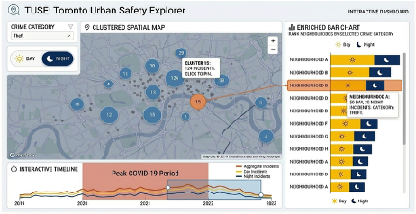

## Planning
Hi, I'm planning on doing a multi-view dashboards for Toronto Urban Safety Explore. It will includes 3 views:
1. **The Clustered Spatial Map (Spatial View)**: Providing dynamic, zoom-depenedent geographic density. Hovering reveals localized detailed, and clusters are clickable to highlight specific selections.
2. **The Interactive Timeline (Temporal View)**: Displaying temporal trends with brushing capabilities.
3. **The Ennriched Horizontal Bar Chart**: This view ranks Toronto neigbourhoods by their total historical crime volume for a selected category. Each horizontal bar is divided into two distincts, color-coded segments for Day vs. Night

## Proposed Dashboard

## Data Processing

Using `python pandas` for data processing 

## Visualization

Using `d3javascript` for interactive visualization